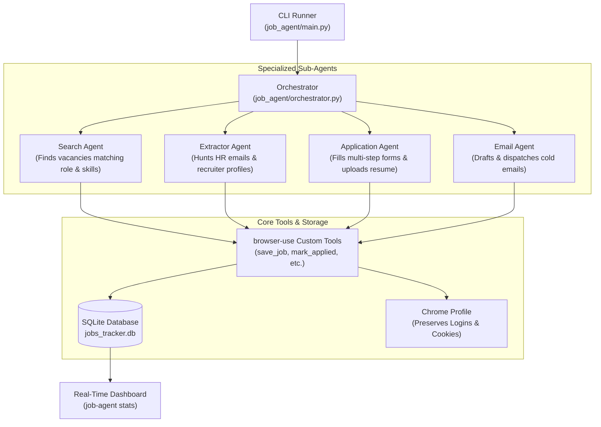

# AI Job Application Agent

Autonomous multi-platform job application and recruitment intelligence system built with **[browser-use](https://github.com/browser-use/browser-use)**.

Supports **LinkedIn**, **Wellfound** (AngelList), and **Naukri**, featuring intelligent form-filling, tailored pitch generation, recruiter OSINT extraction, cold email outreach, and SQLite application tracking.

---

## Architecture Overview



---

## Key Features

1. **Multi-Platform Search**: Searches LinkedIn, Wellfound, and Naukri with filters for role, location, and experience level.
2. **Autonomous Form-Filling**: Navigates multi-step Easy Apply wizards, handles radio buttons, text inputs, dropdowns, and file uploads.
3. **Tailored Pitch Generation**: Generates customized 3-4 sentence cover letters grounding candidate skills directly in job requirements.
4. **Recruiter & HR Contact Extraction**: Discovers hiring managers, technical recruiters, and their emails/LinkedIn links.
5. **Cold Outreach Engine**: Formats and sends high-converting cold emails directly to recruiters via SMTP.
6. **Safety & Stealth**:
   - **`--dry-run` Mode**: Fills every form and verifies accuracy, stopping right before the final submission button.
   - **Persistent Chrome Sessions**: Reuses your real logged-in Chrome user-data-dir to bypass 2FA and bot challenges.
   - **`sensitive_data` Protection**: Credentials are never sent to LLMs or recorded in logs.
   - **Human-like randomized delays** (8-18s) between applications to avoid rate limits.
7. **SQLite Tracker & Analytics**: Tracks every job status (`found`, `applied`, `interview`, `rejected`), cold emails, and interview dates.

---

## Directory Structure

```
job_agent/
├── main.py                    # Click CLI entry point
├── orchestrator.py            # 4-stage pipeline controller
├── config.py                  # Pydantic v2 configuration & models
├── database.py                # SQLite tracking engine
├── .env.example               # Configuration template
├── agents/
│   ├── search_agent.py        # Vacancy finder
│   ├── application_agent.py   # Form filler & submitter
│   ├── extractor_agent.py     # Recruiter OSINT extractor
│   └── email_agent.py         # Cold email campaign manager
├── platforms/
│   ├── base.py                # Platform interface
│   ├── linkedin.py            # LinkedIn Easy Apply logic
│   ├── wellfound.py           # Wellfound startup job logic
│   └── naukri.py              # Naukri application logic
├── tools/
│   ├── job_tools.py           # Custom browser-use actions
│   └── email_tools.py         # SMTP delivery & drafting
├── prompts/
│   ├── search_prompt.py       # Search task prompts
│   ├── application_prompt.py  # Application & screening prompts
│   ├── pitch_prompt.py        # Pitch generation prompts
│   └── extractor_prompt.py    # Recruiter extraction prompts
└── data/
    ├── resume.txt             # Plain text resume for LLM context
    └── jobs_tracker.db        # SQLite database (auto-created)
```

---

## Quickstart

### 1. Configuration
Copy the template and edit your candidate profile:
```bash
cp job_agent/.env.example .env
```

Configure your LLM key:
- `BROWSER_USE_API_KEY`: (Recommended — optimized for browser navigation)
- Or `OPENAI_API_KEY`, `ANTHROPIC_API_KEY`, `GOOGLE_API_KEY`

### 2. Verify Resume
Ensure your resume file exists:
- `job_agent/data/resume.txt` (Included template)
- Optional: Add your real `resume.pdf` for file uploads.

### 3. Run in Dry-Run Mode (Safe)
Test finding jobs and previewing applications without actual submission:
```bash
uv run python job_agent/main.py run --dry-run --roles "Backend Developer" --locations "Remote" --max-apply 3
```

### 4. Run Individual Phases
```bash
# Search only
uv run python job_agent/main.py search --platforms linkedin,wellfound --roles "Python Engineer"

# Extract HR contacts for discovered jobs
uv run python job_agent/main.py extract --limit 10

# Apply to pending jobs
uv run python job_agent/main.py apply --dry-run --limit 5

# Send cold emails
uv run python job_agent/main.py email --limit 5
```

### 5. Check Analytics
```bash
uv run python job_agent/main.py stats
```

### 6. Export to CSV
```bash
uv run python job_agent/main.py export --output my_applications.csv
```
