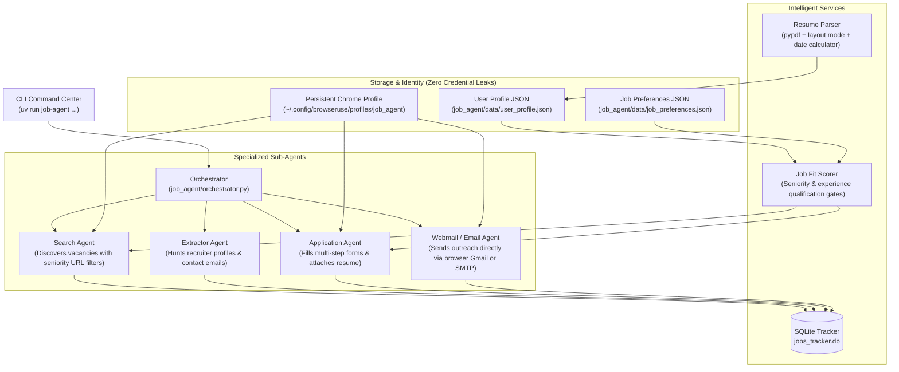

# AI Autonomous Job Application Agent

Autonomous multi-platform recruitment intelligence and job application agent powered by **[browser-use](https://github.com/browser-use/browser-use)**.

Seamlessly navigates **LinkedIn**, **Wellfound** (AngelList), and **Naukri** using real Chrome browser sessions. Automatically parses candidate resumes, calculates exact work experience, enforces strict qualification and seniority gates, fills complex multi-step application forms, drafts tailored cover letter pitches, extracts recruiter contact information, and coordinates cold outreach.

---

## Architecture Overview



---

## Key Features

1. **Interactive Setup Wizard (`job-agent setup`)**:
   - Automatically analyzes your PDF or Markdown resume (`resume.pdf` or `resume.txt`).
   - Calculates your exact professional experience from employment dates (e.g. `0.7 years` for sub-year candidates).
   - Prompts you to confirm or customize details in the terminal.
   - Saves directly to local JSON files (`data/user_profile.json`), **completely eliminating the need to store personal details in `.env`**.

2. **Strict Experience & Seniority Hard Gates**:
   - **Hard Junior Gate**: If candidate experience is $\le 1.0$ year and a role specifies 2+ years of experience, the fit score is **instantly forced to `0.0%`**, preventing irrelevant applications.
   - **Hard Seniority Gate**: Roles titled `Senior`, `Lead`, `Staff`, `Principal`, `Director`, or `Head of` are **automatically rejected (`0.0%`)** if candidate experience is $< 2.5$ years.
   - **Search-Time Filtering**: LinkedIn queries automatically append `&f_E=1,2` (Internship & Entry Level) and Wellfound applies 0-1 year filters.

3. **Autonomous Autopilot & Safety Modes (`job-agent auto`)**:
   - **Ask Mode (`--mode ask`, Default)**: Operates autonomously through search and form filling, pausing to request confirmation before the final submit or email dispatch.
   - **Free Mode (`--mode free`)**: Full autopilot mode that discovers, matches, and applies without human interruption.
   - **Dry-Run Preview (`--dry-run`)**: Fills out every form field and verifies accuracy on-screen, stopping right before the final submission button.

4. **Persistent Browser Sessions (Zero Password Friction)**:
   - Uses your real Chrome profile (`CHROME_USER_DATA_DIR`).
   - Log into LinkedIn, Wellfound, or Gmail once using `job-agent auth` or your local browser.
   - Bypasses 2FA, Captchas, and Cloudflare challenges permanently.
   - Platform credentials do NOT need to be exposed to language models or `.env`.

5. **Stealth Browser Webmail Outreach**:
   - Sends tailored recruiter cold emails directly via webmail in Chrome (`mail.google.com`), avoiding the need for third-party SMTP servers or app passwords.

6. **System Diagnostic Doctor (`job-agent doctor`)**:
   - Performs automated health checks verifying Google Chrome installation, active profile lock status, LLM connection latency, resume existence, database health, and active authentication state.

7. **Database Hygiene & Cleanup**:
   - SQLite tracking database stores all discoveries, applications, recruiters, and interviews.
   - Filter and purge low-scoring jobs with `job-agent clean --min-fit 50.0`.
   - Start completely fresh anytime with `job-agent reset-db`.

---

## Directory Structure

```
job_agent/
├── main.py                     # Click CLI command runner (17 commands)
├── orchestrator.py             # Multi-agent workflow orchestrator
├── config.py                   # Pydantic v2 schemas, profile models, and JSON storage
├── database.py                 # SQLite tracking engine (jobs_tracker.db)
├── .env.example                # LLM API key template
├── agents/
│   ├── search_agent.py         # Vacancy finder with platform-specific filters
│   ├── application_agent.py    # Multi-step Easy Apply form autofill agent
│   ├── extractor_agent.py      # Recruiter and hiring manager OSINT scraper
│   ├── browser_email_agent.py  # Stealth browser webmail (Gmail) dispatcher
│   └── email_agent.py          # SMTP cold outreach dispatcher
├── services/
│   ├── resume_parser.py        # PDF/text parser & work date experience calculator
│   └── fit_scorer.py           # Seniority and experience hard disqualification gates
├── platforms/
│   ├── base.py                 # Abstract platform interface
│   ├── linkedin.py             # LinkedIn Easy Apply logic
│   ├── wellfound.py            # Wellfound startup job logic
│   └── naukri.py               # Naukri job application logic
├── tools/
│   ├── job_tools.py            # Custom browser-use actions (save_job, mark_applied)
│   └── email_tools.py          # SMTP and email formatting actions
├── prompts/
│   ├── search_prompt.py        # Search and seniority filter prompts
│   ├── application_prompt.py   # Screening questions and form-filling prompts
│   ├── pitch_prompt.py         # Tailored cover letter pitch generation
│   └── extractor_prompt.py     # Recruiter extraction prompts
└── data/                       # Local gitignored user data directory
    ├── resume.pdf              # Candidate resume PDF
    ├── resume.txt              # Companion plain text resume for LLM context
    ├── user_profile.json       # Configured candidate profile
    ├── job_preferences.json    # Configured search and mode preferences
    └── jobs_tracker.db         # SQLite application tracker
```

---

## Quickstart Guide

### 1. Prerequisites & Environment Setup

This project requires **[`uv`](https://github.com/astral-sh/uv)** for fast, reliable Python dependency management:

```powershell
# Create virtual environment and install dependencies
uv sync
```

### 2. Configure LLM API Key

Create a `.env` file in `job_agent/.env` (or copy from `.env.example`). You only need an LLM API key:

```env
# ChatBrowserUse is recommended (optimized for browser navigation)
BROWSER_USE_API_KEY="your-api-key"

# Or use OpenAI / Azure OpenAI / Anthropic / Google Gemini
OPENAI_API_KEY="your-api-key"
OPENAI_BASE_URL="https://your-resource.openai.azure.com/openai/v1" # if using Azure
```

> [!NOTE]
> You do **not** need to place personal candidate info, passwords, or SMTP credentials in `.env`. Everything is configured in the next step.

---

### 3. Step-by-Step Onboarding

#### Step 3.1: Run Interactive Setup
Add your resume to `job_agent/data/resume.pdf` or `resume.txt`, then run:

```powershell
uv run job-agent setup
```

The setup wizard will:
1. Detect and parse your resume using layout-aware extraction.
2. Calculate your active work experience from employment dates.
3. Prompt you in the terminal with extracted values as defaults (simply press `Enter` to accept or type to edit).
4. Save your candidate profile to `job_agent/data/user_profile.json` and preferences to `job_preferences.json`.

*(To parse your resume and save immediately without prompts, run `uv run job-agent setup --auto`)*

#### Step 3.2: Verify System Readiness
Run the system doctor diagnostic:

```powershell
uv run job-agent doctor
```

Inspect the diagnostic table:
* **Google Chrome**: Verified executable path.
* **Chrome Profile**: Active user-data directory.
* **LLM Connectivity**: Live ping latency test.
* **Resume & Profile**: Validates candidate profile, skills count, and experience source.
* **Database**: Checks job counts and tables.

#### Step 3.3: Authenticate in Chrome (Once)
Log into your job boards so your session cookies are preserved permanently:

```powershell
# Opens Chrome to log in manually:
uv run job-agent auth --platform all --manual

# Or open a specific platform:
uv run job-agent auth --platform wellfound --manual
uv run job-agent auth --platform linkedin --manual
```

---

### 4. Running the Agent

#### Autonomous End-to-End Recruitment (`auto`)

Search, score, apply, and conduct recruiter outreach across all platforms in a unified run:

```powershell
# 1. Preview / Dry-Run (Safe: fills forms without clicking final submit)
uv run job-agent auto --dry-run

# 2. Interactive Mode (Asks for your terminal confirmation before submitting)
uv run job-agent auto --mode ask

# 3. Autopilot Mode (Full autonomy)
uv run job-agent auto --mode free

# 4. Target specific platforms with experience override:
uv run job-agent auto --platforms wellfound,linkedin --years-exp 0.7 --dry-run
```

#### Individual Phase Execution

You can run individual phases independently as needed:

```powershell
# Phase 1: Search only
uv run job-agent search --platforms wellfound --roles "Full Stack Developer, AI Engineer"

# Phase 2: Extract recruiter & HR contacts for discovered jobs
uv run job-agent extract --limit 5

# Phase 3: Apply to discovered jobs
uv run job-agent apply --dry-run --limit 5

# Phase 4: Cold outreach via browser Gmail
uv run job-agent email --browser-email --limit 3
```

---

## Database Management & Analytics

### View Tracked Jobs
Display all discovered jobs with match percentages and application statuses:

```powershell
uv run job-agent jobs --limit 20
```

### Inspect a Specific Job Record
```powershell
uv run job-agent job show 3
```

### Campaign Analytics Dashboard
View real-time funnel metrics (Discovered, Applied, Interviews, Outreach):

```powershell
uv run job-agent stats
```

### Database Cleanup & Purge
```powershell
# Delete low-relevance jobs below 50% match score:
uv run job-agent clean --min-fit 50.0

# Completely reset the database to start fresh:
uv run job-agent reset-db
```

### Export to CSV
Export all applications, links, and HR contacts to a spreadsheet:

```powershell
uv run job-agent export --output applications.csv
```

---

## CLI Command Reference

| Command | Description | Example |
| :--- | :--- | :--- |
| `setup` | Interactive onboarding wizard; parses resume & saves profile JSON | `uv run job-agent setup` |
| `doctor` | System diagnostics (Chrome, LLM latency, Resume, DB, Auth) | `uv run job-agent doctor` |
| `auth` | Log into job boards and webmail in persistent Chrome profile | `uv run job-agent auth --platform wellfound --manual` |
| `auto` | Autonomous end-to-end recruitment pipeline | `uv run job-agent auto --mode ask --dry-run` |
| `search` | Phase 1: Search designated job boards and catalog vacancies | `uv run job-agent search --platforms linkedin,wellfound` |
| `extract` | Phase 2: Hunt for HR/recruiter emails and LinkedIn contacts | `uv run job-agent extract --limit 10` |
| `apply` | Phase 3: Autofill application forms for pending jobs | `uv run job-agent apply --dry-run --limit 5` |
| `email` | Phase 4: Dispatch cold emails (via browser webmail or SMTP) | `uv run job-agent email --browser-email` |
| `jobs` | List cataloged job records in a formatted table | `uv run job-agent jobs` |
| `job show <id>` | Display complete details, requirements, and notes for a job | `uv run job-agent job show 1` |
| `job delete <id>` | Delete an unwanted job record from the database | `uv run job-agent job delete 5` |
| `clean` | Purge jobs below a minimum fit score threshold | `uv run job-agent clean --min-fit 45.0` |
| `reset-db` | Erase all database records for a fresh start | `uv run job-agent reset-db` |
| `profile show` | Inspect candidate profile, calculated experience, and skills | `uv run job-agent profile show` |
| `pitch <id>` | Generate a custom cover letter / intro pitch for a job | `uv run job-agent pitch 1` |
| `interview log` | Record interview invitations and meeting links | `uv run job-agent interview log --job-id 1 --company Acme` |
| `stats` | Display campaign metrics dashboard | `uv run job-agent stats` |
| `export` | Export tracking history to a CSV file | `uv run job-agent export --output my_jobs.csv` |

---

## Safety, Anti-Detection & Privacy

* **Zero Sensitive Data Leaks**: Your personal candidate information is stored in `job_agent/data/user_profile.json` (gitignored). Credentials in `.env` are never passed to LLMs.
* **Persistent Chrome Profile**: Reuses cookies and authenticated browser sessions rather than repeatedly logging in via headless browsers.
* **Human-Paced Interaction**: Random delays (8–18s) are injected between actions and job applications to protect accounts from platform rate limits.
* **Safe Defaults**: All application and auto commands operate in `--dry-run` mode by default until explicitly configured.
